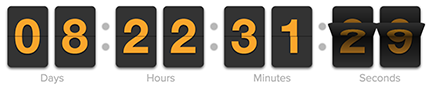
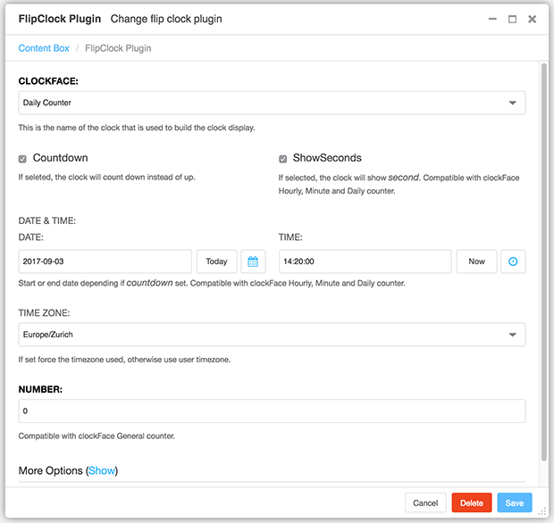

CMS Plugin Flipclock
====================

Django-CMS plugin to add easily FlipClock jQuery Plugin made by
`Objective HTML <https://objectivehtml.com/>`_
and `Justin Kimbrell <https://twitter.com/justin_kimbrell>`_.

The Flip Clock permit to use as:

- Hourly Counter
- Minute Counter
- Daily Counter
- 12hr Clock
- 24hr Clock
- General Counter
- Theme use pure CSS.

**Tips:** You can overwrite some CSS classes to make it fit your design. Also for
making it responsive ready.

Find FlipClock.js project full documentation and live demo on http://flipclockjs.com/.

Example with Daily Counter:

The Plugins permit to control such options:

- **clockFace**: HourlyCounter, MinuteCounter, DailyCounter, TwelveHourClock, TwentyFourHourClock, Counter
- **autoPlay**: If this is set to false, the clock will not automatically add the play class to start the animation
- **autoStart**: If this is set to false, the clock will not auto start
- **countdown**: If this is set to true, the clock will count down instead of up
- **showSeconds** If this is set to true, the clock will show *seconds*. Use with compatible with *clockFace*
- **dateTime**: Start or End date depending if *countdown* set. Use with compatible *clockFace*.
- **numbers**: To use with clockFace *General counter*

Allow multi FlipClock by page, but not recommended by the fact such JS plugin
take lot of CPU!

Each ClickFlip expose **clock** JS global variable for API manipulations.

Django CMS Plugin setup screen:

